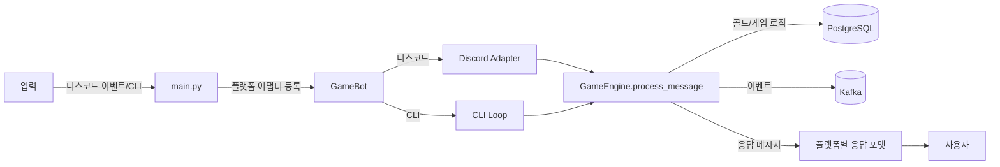

# Code-Driven Project Overview

이 문서는 현재 코드베이스(비 MD 파일 기준)를 분석하여 재구성한 개요입니다. 디스코드 챗봇(및 로컬 CLI)용 게임 서버 흐름, API, 데이터 모델, 실행 방법을 간략히 정리합니다. 카카오 웹훅 기반 구성은 제거되었습니다.

## 아키텍처
- **엔트리 포인트**: `main.py`는 `GameBot`을 생성해 디스코드 어댑터와 게임 엔진을 연결하며 CLI 모드도 지원합니다.
- **웹 서버**: 카카오 웹훅 서버 코드는 제거되었습니다. `run_server.py`는 단일 프로세스 디스코드 런타임을 실행합니다.
- **게임 엔진**: `game_engine.py`는 골드 시스템과 우주 탐험 로그 게임(우주선 강화+임무)을 묶는 허브입니다. 메시지 파서를 통해 골드 조회/전송, 리더보드, 게임 시작/종료, 도움말 명령을 처리합니다.
- **플랫폼 어댑터**: `platforms/discord_adapter.py`가 디스코드 메시지 이벤트를 게임 엔진에 연결합니다. 멘션 문자열 생성 기능을 노출해 게임 엔진이 플랫폼별 멘션을 추가할 수 있습니다.
- **이벤트/확장성**: Kafka 발행은 선택적(`Config.USE_KAFKA`)이며, 골드/통계 이벤트를 `events.kafka_producer.publish_event`로 내보내도록 훅이 준비돼 있습니다.

## 설정 (환경 변수)
주요 설정은 `config.py`에 정의되며 `.env`로 주입됩니다. 기본값은 다음과 같습니다.

| 구분 | 주요 항목 | 기본값 |
| --- | --- | --- |
| 플랫폼 | `PLATFORM` | `discord` |
| Discord | `DISCORD_TOKEN`, `DISCORD_COMMAND_PREFIX` | `None`, `!` |
| 데이터 | `DATA_FILE`, `INITIAL_GOLD` | `data.db`, `100` |
| Postgres | `POSTGRES_HOST`, `POSTGRES_PORT`, `POSTGRES_DB`, `POSTGRES_USER`, `POSTGRES_PASSWORD` | `localhost`, `5432`, `kakao_game`, `postgres`, `postgres` |
| Kafka | `KAFKA_BOOTSTRAP_SERVERS`, `USE_KAFKA` | `localhost:9092`, `true` |
| 게임(우주 탐험 로그) | `ENHANCEMENT_MAX_LEVEL`, `ENHANCEMENT_BASE_COST`, `ENHANCEMENT_COST_MULTIPLIER`, `ENHANCEMENT_SELL_MULTIPLIER`, `ENHANCEMENT_LEVEL_BONUS`, `MONSTER_HUNT_REWARD_MULTIPLIER`, `BOSS_TICKET_DROP_RATE` | `15`, `40`, `1.4`, `0.6`, `40`, `0.1`, `0.3` |
| 서버/로깅 | `SERVER_HOST`, `SERVER_PORT`, `EXTERNAL_PORT`, `USE_NGINX`, `GUNICORN_WORKERS`, `LOG_LEVEL`, `LOG_FILE` | `0.0.0.0`, `5000`, `8080`, `true`, `4`, `INFO`, `None` |

## API 개요 (FastAPI)
### 골드 `/api/gold`
- `GET /{user_id}`: 골드 조회(없으면 0G로 생성).
- `POST /{user_id}/add`: 골드 추가(>0). `reason` 전달 시 이력 기록 및 Kafka 이벤트 발행.
- `POST /{user_id}/deduct`: 골드 차감(잔액 부족 시 400).
- `PUT /{user_id}`: 절대값으로 설정.
- `POST /transfer`: 사용자 간 전송. 동일 사용자 전송 또는 잔액 부족 시 400, 이력 2건 생성, Kafka 발행 가능.
- `GET /{user_id}/history?limit=10`: 최근 변동 이력 조회(내림차순).
- `GET /leaderboard?limit=10`: 골드 상위 N명 리스트와 총 사용자 수 반환.

### 보스 입장권 `/api/boss-tickets`
- `GET /{user_id}`: 티켓 조회(없으면 0장으로 생성).
- `POST /{user_id}/add`: 티켓 추가(>0).
- `POST /{user_id}/use`: 티켓 사용(부족 시 400).
- `PUT /{user_id}`: 절대값으로 설정.

### 강화 레벨 `/api/enhancement`
- `GET /{user_id}`: 강화 레벨 조회(없으면 0으로 생성).
- `PUT /{user_id}`: 절대값으로 설정(0 미만 방지).

### 게임 통계 `/api/stats`
- `GET /{user_id}`: 통계 조회(없으면 기본값 생성).
- `POST /{user_id}`: 전체 필드를 덮어쓰듯 생성/갱신 후 Kafka 발행 가능.
- `PATCH /{user_id}`: 제공된 필드만 증가 처리 후 Kafka 발행 가능.
- `PUT /{user_id}`: 제공된 필드를 절대값으로 설정.

## 데이터베이스 스키마 (PostgreSQL)
- `gold(user_id PK, gold, created_at, updated_at)`
- `gold_history(id PK, user_id indexed, amount, reason, created_at indexed)`
- `boss_tickets(user_id PK, tickets, created_at, updated_at)`
- `enhancement_levels(user_id PK, level, created_at, updated_at)`
- `game_stats(user_id PK, enhancement_attempts/successes/failures, hunt_normal/special/boss, total_hunts, total_hunt_reward, created_at, updated_at)`

세션 관리는 `models.database`의 `SessionLocal` 의존성을 통해 FastAPI에서 주입되며, `init_db()`로 테이블을 생성합니다.

## 실행 흐름 요약
1. `python main.py [discord|cli]`로 시작. 디스코드 모드는 봇 런타임을 시작하고 CLI 모드는 터미널 상호작용을 제공합니다.
2. 게임 엔진은 최초 메시지에서 초기 골드를 지급하고, 골드/리더보드/게임 목록/도움말/게임 시작/종료 등의 명령을 처리합니다. 활성 게임이 있을 때는 해당 게임 객체에 명령을 위임하며, 우주 탐험 로그 게임 시 강화/임무/정산/상태 확인 등의 행동을 지원합니다.
3. Kafka 사용 시 골드·통계 이벤트가 브로커로 발행됩니다.

### 실행 흐름 다이어그램 (Mermaid)

### 이벤트·API 흐름 아이콘 요약

- ▶️ 입력 경로: 디스코드 이벤트 핸들러, 로컬 CLI.
- 🧭 라우팅: 플랫폼 어댑터가 메시지를 `GameEngine`으로 전달.
- 🧮 도메인 로직: 골드 시스템/게임 엔진이 DB 읽기·쓰기, 이벤트 발행(Kafka).
- 📨 응답: 플랫폼별 템플릿(카카오 스킬 JSON, 디스코드 메시지) 또는 CLI 텍스트로 전달.

## 운영 팁
- 환경 변수로 플랫폼·DB·Kafka·게임 파라미터·서버 포트를 관리하세요(`.env` 필요).
- PostgreSQL 연결 풀은 기본 `pool_size=10`, `max_overflow=20`로 설정되어 있어 트래픽 증가에 대비합니다.
- Kafka 비사용 시 `USE_KAFKA=false`로 비활성화하면 이벤트 발행이 건너뜁니다.
