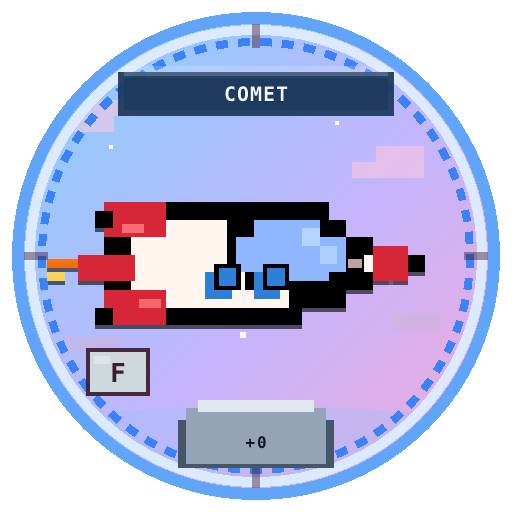

# 우주 탐험 공략집

디스코드 **우주 탐험 로그** 봇의 공식 플레이어 가이드입니다.

> 탭 한 번 → 짧은 결과 → 다시 탭.  
> 이 공략집은 **코어 루프**를 깨지 않으면서 골드·등급·도감을 효율적으로 키우는 방법을 정리합니다.



## 이 게임이 하는 일

| 역할 | 하는 일 |
|------|---------|
| **출동** | 메인 골드·득템·기체 드랍 (가변 보상) |
| **강화** | 본체 +N · 파츠 +N (하이리스크 피크) |
| **도감** | F~S 수집 · NEW / 중복 보상 |
| **상태·골드·패스** | 확인용 (루프의 중심은 아님) |

## 추천 읽기 순서

1. [5분 빠른 시작](start/quickstart.md) — 지금 당장 버튼만 누르기  
2. [한 줄 루프 이해](loop/overview.md) — 왜 `다시 출동` / `강화` 버튼이 뜨는지  
3. [초보 로드맵](tips/beginner.md) — 첫 세션 루트  
4. [등급 F~S](ships/grades.md) · [등가 계승](ships/inherit.md) — 성장 모델  
5. [수치 요약표](reference/numbers.md) — 숫자만 빠르게  

## 한 줄 공략

```text
출동 연타로 골드 → 강화로 +N → (골드 부족하면) 다시 출동
상위 기체 뜨면 계승 확인 → 도감 빈칸 메우기 → 일일 목표 클리어
```

실패해도 **구조금**이 나오고, 중복 기체도 **분해 골드**가 나갑니다.  
“완전 꽝”은 설계상 없습니다. 마음이 편해지면 루프가 길어집니다.

## 버전 메모

- UI: 모바일 온리 (DETAIL 15×25 + 버튼 2 / MENU 5×25 + 버튼 4)  
- 루프 CTA: 결과 화면은 홈 대신 **다시 하기 + 교차 행동** (#19)  
- 기체: 등급 F~S · 본체 +N · 파츠 +N · 등가 계승 (#15)  

수치는 서버 `config` 로 튜닝될 수 있습니다. 표의 값은 **기본값 기준**입니다.
