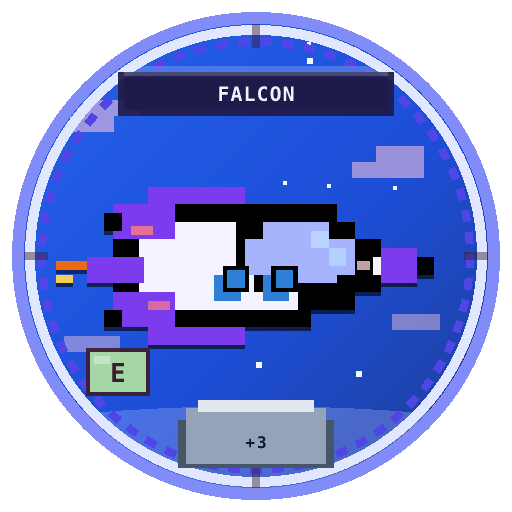
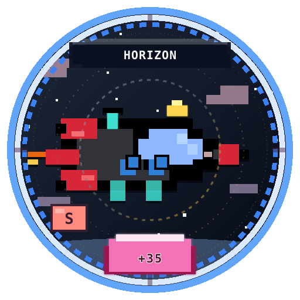

# 도감 전체 목록

총 **10종**. 등급별 수집 현황은 `도감 → 목록` 에서 확인.

| 등급 | 이름 | id | 플레이버 |
|------|------|-----|----------|
| F | 코멧 스카우트 | comet_scout | 근거리 정찰 입문기 |
| F | 카고 뮬 | cargo_mule | 잔해 부품 수송 |
| F | 루나 모스 | lunar_moth | 달빛 도장 인기 기체 |
| E | 아이온 팔콘 | ion_falcon | 이온 항로 프리깃 |
| D | 네뷸라 레이 | nebula_ray | 성운 센서함 |
| D | 오로라 클립 | aurora_clip | 극광 입자 실험기 |
| C | 퀀텀 폭스 | quantum_fox | 양자 도약 고급기 |
| B | 보이드 만타 | void_manta | 암흑 물질 코팅 |
| A | 솔라 드래곤 | solar_dragon | 항성풍 정예 순양 |
| S | 이벤트 호라이즌 | event_horizon | 블랙홀 경계 회수기 |





## 목록 UI

```text
📚 도감 1/N
수집 k/10종
주력 …
F a/3
-이름 or -???
…
```

- `★` 표시 = 현재 장착  
- `x2` = 중복 획득 횟수  
- `???` = 미발견  

**다음** 버튼으로 페이지 이동 (depth D2→D3).
