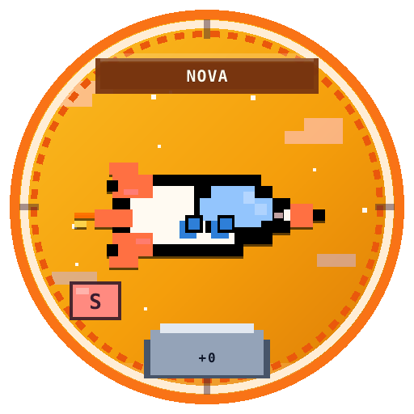
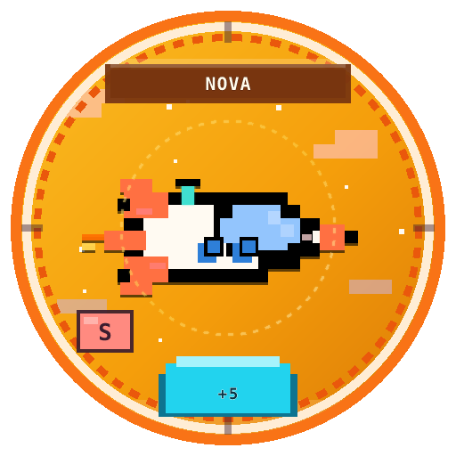
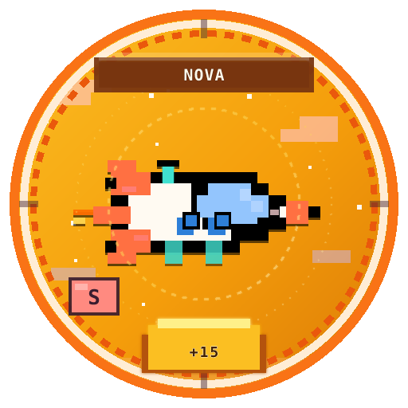
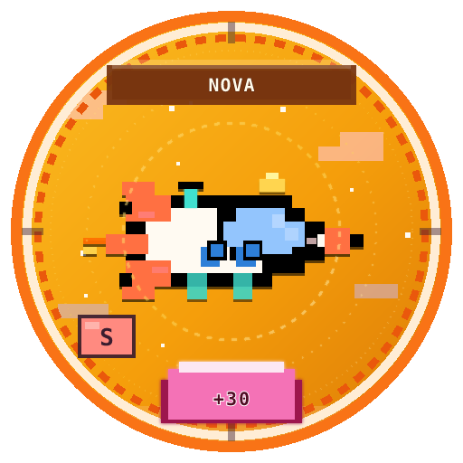

# 마일스톤 · 배지

## 본체 마일스톤

다음 본체 단계에 도달하면 연출 + 보너스 골드:

**+5, +10, +15, +20, +25, +30**

```text
⬆️ 마일스톤 +N
배지 stage K · +골드
```

보너스 골드 ≈ `25 × max(1, N/5)` (기본 상수 기준)

## 배지 stage (비주얼)

본체 +N → 배지 디테일 단계:

| 본체 +N | stage |
|---------|-------|
| 0~4 | 0 |
| 5~14 | 1 |
| 15~29 | 2 |
| 30+ | 3 |






## 공략 포인트

- +4 → +5, +9 → +10 직전은 **세션 목표**로 잡기 좋습니다.  
- 마일스톤 실패로 -1 되면 다시 직전으로 — pity를 활용해 재도전.  
- 정산(판매)하면 본체는 0이 되지만 **배지 stage 루프 카운트**는 게임 데이터에 남을 수 있습니다. 등급·파츠는 유지.
