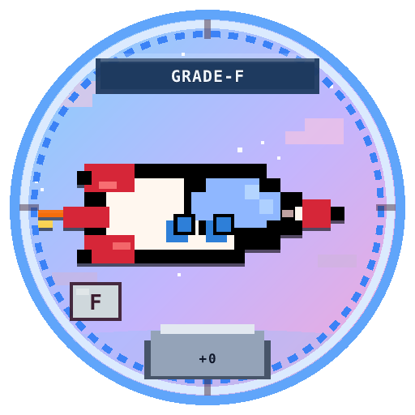
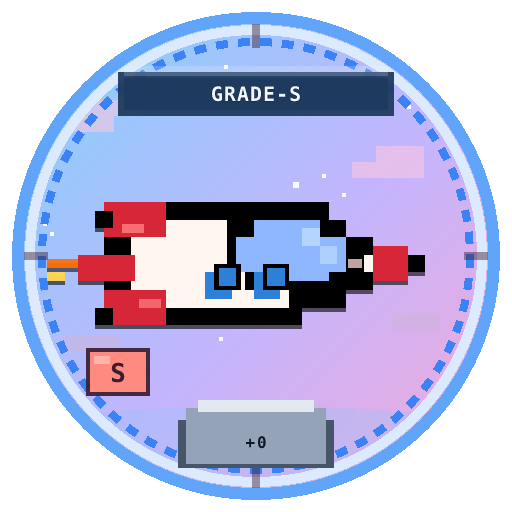

# 등급 F~S 시스템

기체 티어는 **F → E → D → C → B → A → S** 한 축입니다.  
(구 희귀도 common/rare/… 표기는 사용하지 않습니다.)




## 기체 한 줄 모델

```text
기체 = 이름 + 등급(F~S) + 본체+N + 파츠+N들
```

- **등급**: 기체 자체 희소·기본 스탯  
- **본체 +N**: 강화로 올리는 성장  
- **파츠 +N**: 엔진/센서/장갑 패시브 (파츠에 등급 없음)

## 드롭 가중치 (도감 발견 시 등급)

| 등급 | 가중 | 대략 감 |
|------|------|---------|
| F | 40 | 흔함 |
| E | 25 | |
| D | 15 | |
| C | 10 | |
| B | 6 | |
| A | 3 | |
| S | 1 | 매우 희귀 |

같은 등급 안에서는 해당 카탈로그 기체를 **균등** 선택.

## 스탯 앵커

```text
스탯 ≈ base(등급) + 본체+N
base는 등급 한 칸당 +99 스케일
→ F+100 ≈ E+1  (등가 계승)
```

상위 기체를 껴도 **환산 +N** 이 맞으면 전투력(성공률·보상 배율)이 유지됩니다.  
자세한 환산은 [등가 계승](inherit.md).

## 표기 예시

```text
코멧 스카우트 ★F +12
아이온 팔콘 ★E +1
```
